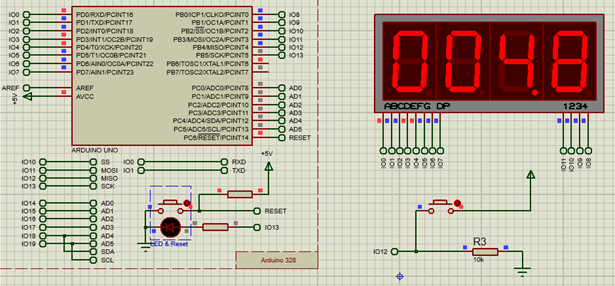
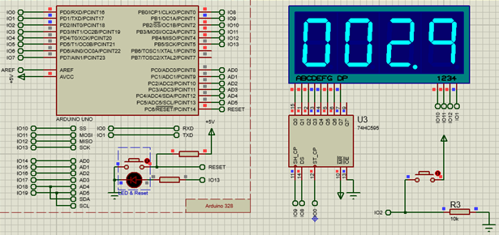

# Stopwatch using Seven Segment Display and Arduino

This project includes two C files and two schematics:
The first one is for Seven Segment Display without interrupt. The second one is for Seven Segment Display using interrupts.

# Usage
When pressing the button, the stopwatch changes its state respectively 'start', 'stop', and 'reset'.

# For more detail:
See the source code and schematics.

